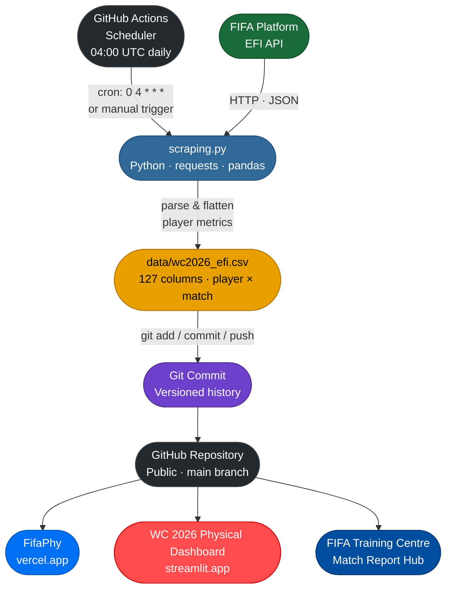

# EFI FIFA Data — World Cup 2026 🏆
 
Automated pipeline to collect and store **Enhanced Football Intelligence (EFI)** data from the official FIFA website for the 2026 FIFA World Cup (USA · Canada · Mexico).
 
## What it does
 
Scrapes player-level EFI metrics from the FIFA platform after each match and stores them as a structured, analysis-ready CSV file. Data is versioned through Git, building a clean cumulative record across the full tournament.
 
## How it works
 
A scheduled **GitHub Actions** workflow runs automatically once a day (04:00 UTC), after the latest matches have concluded and FIFA has processed the data. No manual intervention required.
 

 
## Data
 
The main file is `data/wc2026_efi.csv` — one row per player per match, with **127 columns** covering:
 
| Category | Metrics |
|----------|---------|
| **Identity** | `player_id`, `match_id`, `team_id`, `team_name`, `player_name`, `position`, `birthday` |
| **Attacking** | `goals`, `xg`, `attempt_at_goal*`, `threat`, `assists`, `take_ons_completed` |
| **Physical** | `total_distance`, `avg_speed`, `top_speed`, `sprints`, `speed_runs`, `distance_*` (walking → sprinting) |
| **Passing & progression** | `passes`, `passes_completed`, `completed_ball_progressions`, `linebreaks_*` |
| **Defending** | `forced_turnovers`, `defensive_pressures_applied`, `goalkeeper_*` |
| **Receiving** | `offers_to_receive_*`, `receptions_*` |
| **Disciplinary** | `yellow_cards`, `red_cards`, `fouls_for`, `fouls_against` |
 
## Schedule
 
```yaml
on:
  schedule:
    - cron: '0 4 * * *'   # Daily at 04:00 UTC — after all late NA matches conclude
  workflow_dispatch:        # Manual trigger available
```
 
## Stack
 
- **Scraping & processing**: Python (`requests`, `pandas`)
- **Automation**: GitHub Actions
- **Storage**: CSV versioned in this repository
## Use case
 
The data collected by this pipeline feeds the production of **post-match summary reports** published on the [FIFA Training Centre — Match Report Hub](https://www.fifatrainingcentre.com/en/fifa-world-cup-2026/match-report-hub.php). These reports cover all FIFA World Cup 2026™ matches, organised by group, and are released progressively as the tournament unfolds.
 
EFI metrics extracted here are used to analyse player and team performance across each match, supporting the technical narrative in those reports.
 
## EFI definitions
 
For a full reference of the metrics and concepts behind the EFI data, see the **FIFA Football Language** glossary published by the FIFA Training Centre:
 
 [The FIFA Football Language](https://www.fifatrainingcentre.com/en/game/performance-analysis/football-language-analysis/the-fifa-football-language.php)
 
## Apps built with this data
 
| App | Description |
|-----|-------------|
| [**FifaPhy**](https://fifaphy.vercel.app) | Interactive physical performance explorer for WC 2026 — player, team, and head-to-head views |
| [**WC 2026 Physical Dashboard**](https://wc2026-physical.streamlit.app) | Streamlit dashboard for in-depth physical analytics across the tournament |
 
## Usage
 
Clone the repo and use the data directly from the `data/` folder. No setup needed — files are refreshed automatically.
 
```python
import pandas as pd
efi = pd.read_csv("data/wc2026_efi.csv")
```
 
---
 
> Data sourced from the official FIFA platform. This repository is intended for analytical and research purposes only.
